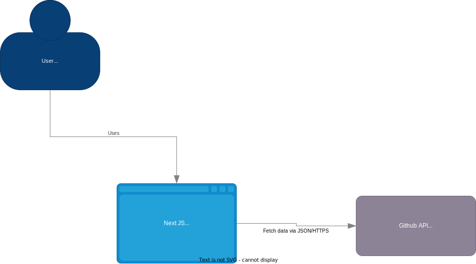
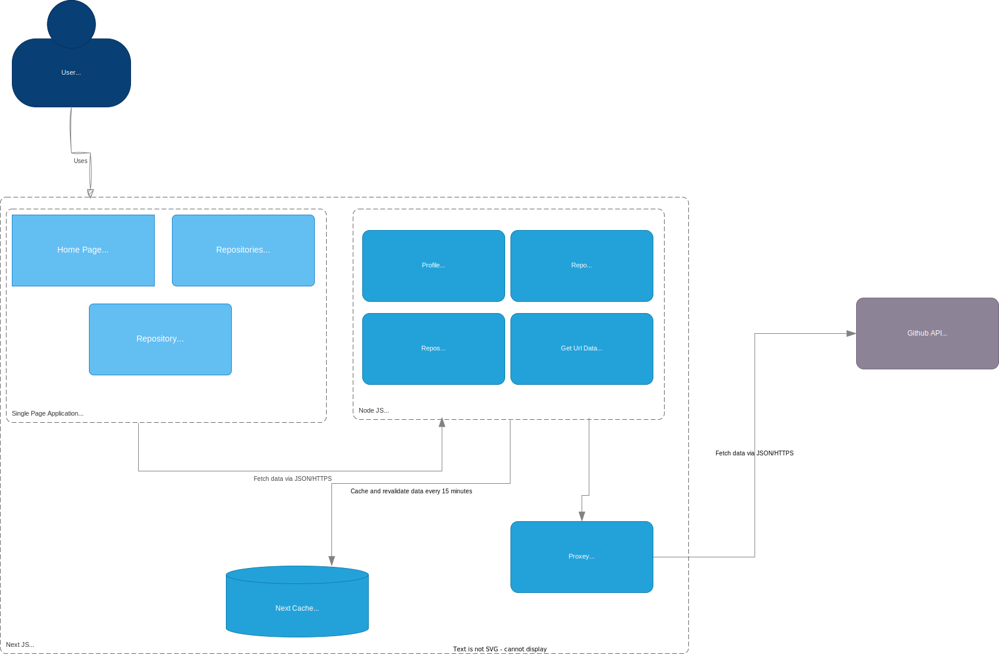

## Getting Started

Install dependencies needed:

```bash
npm install
# or
yarn install
# or
pnpm install
```

In order for the application to work you need to provide a Github API Key.

Create a .env.local file and add the following:

```bash
NEXT_PUBLIC_GITHUB_API_KEY=YOUR_API_KEY_GOES_HERE
```

Feel free to configure your api key how you like. (Weather you only want access to public repositories, selected repositories or all repositories)


then run the development server:

```bash
npm run dev
# or
yarn dev
# or
pnpm dev
```

## Ready For Production

There are multiple way to deploy this application this guild will go over each solution.

### First Solution

***Deploying to Vercel.***

1. Go to [Vercel.com](https://vercel.com/) and create an account. (Note you can create you're account through GitHub)
2. Click add new project and import from [https://github.com/jav1anpry5ce/se577_course_project](https://github.com/jav1anpry5ce/se577_course_project)

NOTE ensure that ```frontend``` is selected as the root of the project
3. Add the following environment variable  
```bash
NEXT_PUBLIC_GITHUB_API_KEY=YOUR_API_KEY_GOES_HERE
NEXT_PUBLIC_PROD_URL=THIS_WILL_BE_PROVIDED_AFTER_DEPLOYMENT
```

4. That's it! You're Done! Vercel will provide you a url where you can view the live site. (Note. This url is public and can be shared to anyone!)

### Second Solution

***Docker***

1. A Dockerfile should be included in this repository. (Also see below)
```
FROM node:18-alpine AS base

# Install dependencies only when needed
FROM base AS deps
RUN apk add --no-cache libc6-compat
WORKDIR /app

# Install dependencies based on the preferred package manager
COPY package.json yarn.lock* package-lock.json* pnpm-lock.yaml* ./
RUN \
  if [ -f yarn.lock ]; then yarn --frozen-lockfile; \
  elif [ -f package-lock.json ]; then npm ci; \
  elif [ -f pnpm-lock.yaml ]; then yarn global add pnpm && pnpm i --frozen-lockfile; \
  else echo "Lockfile not found." && exit 1; \
  fi


# Rebuild the source code only when needed
FROM base AS builder
WORKDIR /app
COPY --from=deps /app/node_modules ./node_modules
COPY . .


ARG GITHUB_API_KEY=""
ARG PROD_URL=""

ENV NEXT_PUBLIC_GITHUB_API_KEY=$GITHUB_API_KEY
ENV NEXT_PUBLIC_PROD_URL=$PROD_URL

RUN npm run build

# Production image, copy all the files and run next
FROM base AS runner
WORKDIR /app

ENV NODE_ENV production

RUN addgroup --system --gid 1001 nodejs
RUN adduser --system --uid 1001 nextjs

COPY --from=builder /app/public ./public

COPY --from=builder --chown=nextjs:nodejs /app/.next/standalone ./
COPY --from=builder --chown=nextjs:nodejs /app/.next/static ./.next/static

USER nextjs

EXPOSE 80

ENV PORT 80

CMD ["node", "server.js"]
```
2. Run the following command
```
docker build --build-arg GITHUB_API_KEY=YOUR_API_KEY --build-arg PROD_URL=YOUR_PROD_URL_GOES_HERE . --load
```
3. That's it! Deploy your docker container!

## Architecture

### High Level


### Low Level
